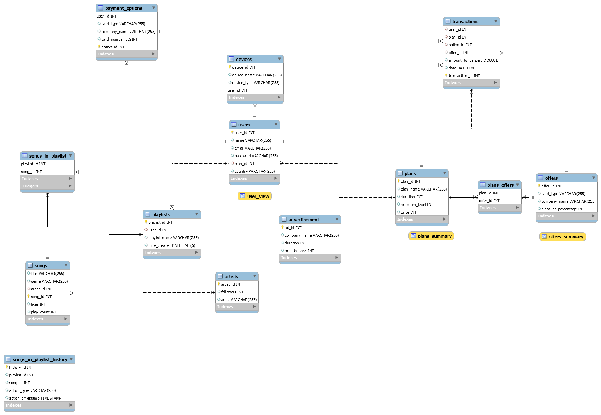

# AudioVibe Project

## Overview

AudioVibe is a music platform that offers a vast catalog of music accessible to users across various countries. The platform provides key functionalities such as user profile management, playlist creation, and seamless music streaming.
## Key Functionalities

1. **User Management:**
   - Users can add personal information during sign-up.
   - Users can update their information, including changing passwords.
   - Deletion of personal information is also supported.

2. **Playlist Management:**
   - Users have the ability to create playlists.
   - Adding and deleting songs from playlists is supported.
   - Users with subscriptions can skip advertisements during streaming.

3. **Seamless Experience:**
   - Robust identity management ensures secure user accounts.
   - Secure transaction processing for premium subscriptions.
   - Intuitive playlist management for personalized user experience.

## Data Sources and Tools

**Data Sources:**
- Kaggle Dataset: [TikTok Songs 2020](https://www.kaggle.com/code/tayyarhussain/tiktok-songs-2020-dataset-data-analysis)
- Manual generation of data

**Tools:**
- MySQL Workbench
- Java
- Python
- Spring Boot
- Postman

## Project Components

### Entity-Relationship Diagram (ERD)

## Recommendations and Strategies

- Leverage genre distribution insights for recommendation algorithms.
- Focus on user engagement strategies in countries with low user counts.
- Targeted incentives for popular subscription plans.
- Evaluate marketing strategies for less-used plans.
- Offer promotions and discounts during peak subscription periods.
- Strategic partnerships with businesses for exclusive deals.

## Conclusion

AudioVibe's data-driven approach provides valuable insights for user engagement, marketing, and subscription strategies. The project team has successfully implemented key features for a seamless music streaming experience.
